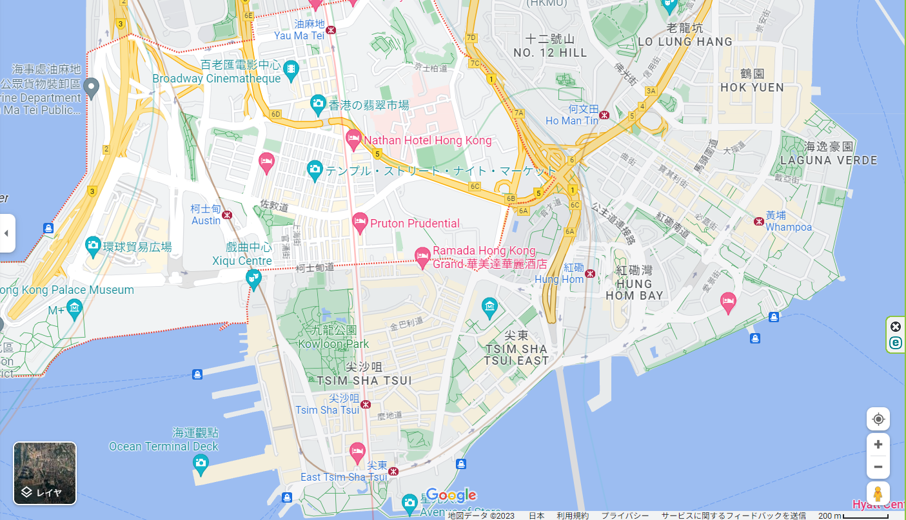

# Map of Yau Ma Tei (油麻地)

https://www.google.co.jp/maps/place/%E9%A6%99%E6%B8%AF+%E6%B2%B9%E9%BA%BB%E5%9C%B0/@22.30759,114.1570621,15z/data=!3m1!4b1!4m6!3m5!1s0x3404009533f68457:0x69f4ecff87253282!8m2!3d22.3068537!4d114.1714423!16zL20vMDF2bTQw?entry=ttu

This map shows my home in Hong Kong. I live around Yau Ma Tei (at the top of the screenshot), and the map shows how close Yau Ma Tei is to Victoria Harbour, one of the Star Attractions of Hong Kong (It's cut out at the bottom but that's Victoria Harbour!). It takes around 30 minutes to walk from my home to Victoria Harbour, and I would spend some of my weekends at the Harbour, either window-shopping or just enjoying the view.

While the map is zoomed out and doesn't show the urban junglescape of Hong Kong (it's there but it is really hard to see), I chose to emphasize the close distance between my home and Victoria Harbour. Other showing the close distance, the map screenshot also shows the MTR (Mass Transit Railway) of Hong Kong. Hong Kong is a small place, so you can find these stations all over Hong Kong, in pretty close proximity. The only thing I wish the map could've shown better is the building density in Hong Kong, and the height of the buildings in Hong Kong. Without 3D models, it's really hard to describe how suffocating the buildings are in Hong Kong.
